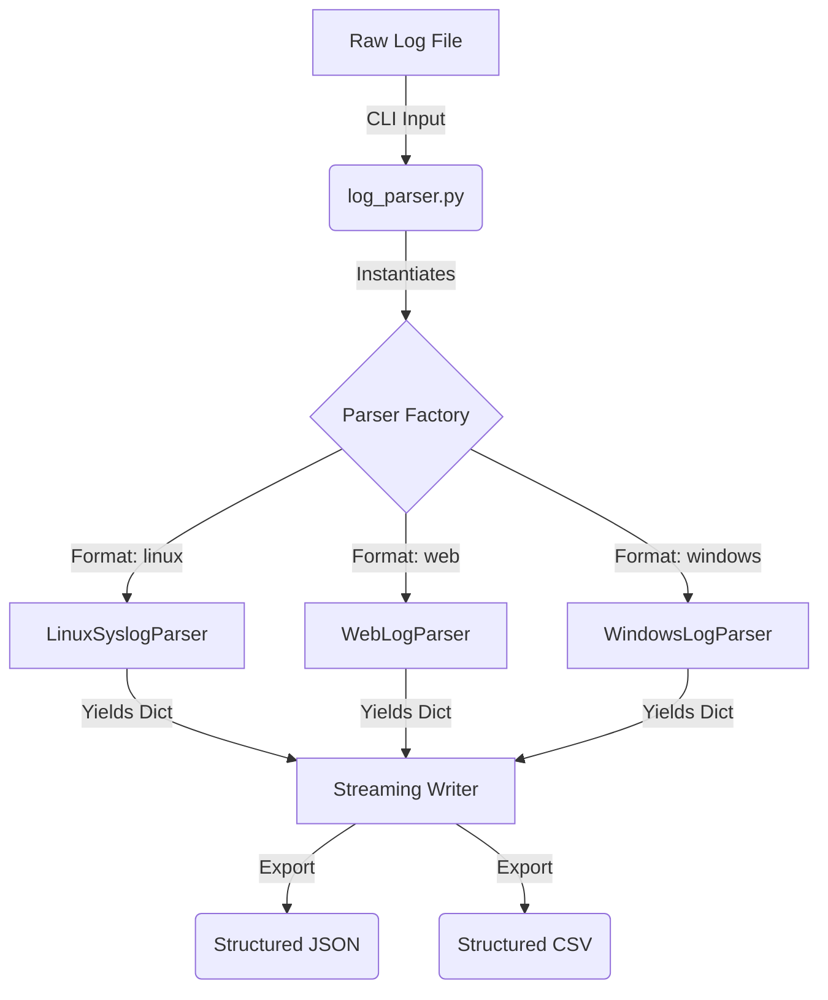

# Log Parser Toolkit


[](https://www.python.org/downloads/)
[](https://opensource.org/licenses/MIT)
[](https://github.com/LiamCarPer/log-parser-toolkit/actions/workflows/test.yml)

A robust, memory-efficient Python command-line utility designed to parse various unstructured log formats into structured JSON or CSV files. 

This toolkit was built to demonstrate clean software architecture, advanced regular expression (regex) parsing, **streaming data processing** (Generator pattern for large files), and user-friendly CLI design using `argparse`. It serves as a flexible ingestion layer for log data analysis.

## Table of Contents
- [Architecture](#architecture)
- [Features](#features)
- [Supported Formats](#supported-formats)
- [Project Structure](#project-structure)
- [Installation](#installation)
- [Usage](#usage)
- [Examples](#examples)
- [Testing](#testing)
- [Future Enhancements](#future-enhancements)

## Architecture

The system uses a modular design, allowing new parsers to be added dynamically. It utilizes a **generator pattern** to stream lines, avoiding Out-Of-Memory (OOM) issues on massive log files.



## Features

- **Memory Efficient (Streaming):** Parses logs line-by-line using Python Generators (`yield`). Can process multi-gigabyte log files without crashing or hogging RAM.
- **Resource Management:** Employs Python Context Managers (`with` magic methods) to strictly secure file handles and prevent I/O leaks on errors.
- **Dead-Letter Queue Support:** Robust error handling gracefully routes malformed or unmatched log lines to a separate `--error-file` without corrupting the primary structured data export.
- **Schema Validation & Typing:** Hardened ingestion process validates input structures (e.g., CSV headers) before parsing to guarantee downstream data integrity.
- **Dynamic Plugin Factory (Open-Closed Principle):** New parsers added to the `parsers/` directory are auto-discovered via subclass introspection and immediately available via the CLI without modifying the core logic.
- **Dependency-Free Core:** Uses only standard library modules (`json`, `csv`, `re`) for parsing and writing. No heavy third-party dependencies required.
- **CI/CD Pipeline:** Fully integrated with GitHub Actions to run automated `pytest` suites on every push.

## Supported Formats

- **Linux Syslog** (`linux`): Parses standard Linux syslog messages extracting Timestamp, Hostname, Process/PID, and the core Message.
- **Web Logs** (`web`): Parses the industry-standard Apache/Nginx combined log format (IP, Ident, User, Timestamp, Request, Status, Bytes, Referer, User-Agent).
- **Windows Event Logs** (`windows`): Parses Windows Event Logs that have been exported to CSV format, acting as a normalization layer.

## Project Structure

```text
log-parser-toolkit/
├── log_parser.py          # Main CLI entry point
├── pyproject.toml         # Package definition
├── parsers/               # Parser modules
│   ├── base.py            # Abstract BaseParser class
│   ├── linux.py           # Syslog parsing logic (Regex)
│   ├── web.py             # Apache/Nginx parsing logic (Regex)
│   └── windows.py         # Windows CSV ingestion
├── samples/               # Sample log files for testing
├── tests/                 # Pytest unit tests
└── .github/workflows/     # CI/CD pipelines
```

## Installation

1. Ensure you have Python 3.8+ installed.
2. Clone the repository and navigate to the root directory.
3. Install the package in a virtual environment:

```bash
# Create a virtual environment
python -m venv .venv

# Activate the virtual environment
# On macOS/Linux:
source .venv/bin/activate  
# On Windows:
# .venv\Scripts\activate

# Install the toolkit locally (makes `log-parser` available globally in the venv)
pip install -e .
```

## Usage

Once installed, you can use the `log-parser` command anywhere inside your virtual environment.

```bash
log-parser --input <path_to_log> --format <format_name> --output <path_to_output> --type <json|csv> [--strict] [--error-file <path>]
```

### Arguments:

- `--input`: Path to the input log file.
- `--format`: Format of the log file. Dynamically discovers available parsers (e.g., `linux`, `web`, `windows`).
- `--output`: Path to save the parsed output file.
- `--type`: Desired output file type (`json` or `csv`).
- `--error-file`: (Optional) Path to save unmatched log lines (dead-letter file) to keep primary output clean.
- `--strict`: (Optional) If enabled, stop execution and fail immediately on the first unmatched line.
- `--verbose`: (Optional) Enable debug-level logging.

## Examples

The toolkit includes sample log files in the `samples/` directory to demonstrate functionality.

### 1. Parsing Linux Syslog to JSON

**Command:**
```bash
log-parser --input samples/sample_syslog.log --format linux --output output_syslog.json --type json
```

### 2. Parsing Apache/Nginx Web Logs to CSV

**Command:**
```bash
log-parser --input samples/sample_apache.log --format web --output output_apache.csv --type csv
```

## Testing

The project uses `pytest` for unit testing the regex patterns and parser logic. 

To install test dependencies and run the test suite:

```bash
pip install -e .[test]
pytest tests/
```

## Future Enhancements
- **Database Export:** Add direct insertion to SQLite or PostgreSQL databases using SQLAlchemy.
- **Threat Intelligence:** Integrate an optional flag to cross-reference extracted IP addresses against public threat intelligence feeds.
