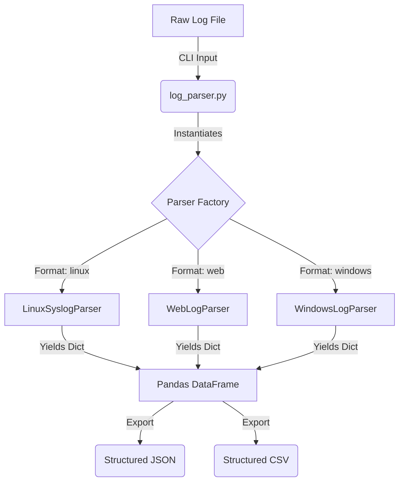

# Log Parser Toolkit


[](https://www.python.org/downloads/)
[](https://opensource.org/licenses/MIT)

A robust Python command-line utility designed to parse various unstructured log formats into structured JSON or CSV files. 

This toolkit was built to demonstrate clean software architecture, advanced regular expression (regex) parsing, data manipulation with `pandas`, and user-friendly CLI design using `argparse`. It serves as a flexible ingestion layer for log data analysis.

## Table of Contents
- [Architecture](#architecture)
- [Features](#features)
- [Supported Formats](#supported-formats)
- [Project Structure](#project-structure)
- [Installation](#installation)
- [Usage](#usage)
- [Examples](#examples)
- [Testing](#testing)
- [Future Enhancements](#future-enhancements)

## Architecture

The system uses a modular design, allowing new parsers to be added dynamically.



## Features

- **Modular Architecture:** Utilizes a `BaseParser` interface, making it trivial to extend the tool to support new, custom log formats without altering core logic.
- **Structured Output:** Converts plain text logs into machine-readable JSON or CSV formats, ready for ingestion by SIEMs, databases, or data visualization tools.
- **Data Engineering Ready:** Leverages `pandas` under the hood for efficient data structuring and export.
- **Comprehensive Testing:** Includes unit tests using `pytest` to guarantee the accuracy and reliability of regex patterns against edge cases.

## Supported Formats

- **Linux Syslog** (`linux`): Parses standard Linux syslog messages extracting Timestamp, Hostname, Process/PID, and the core Message.
- **Web Logs** (`web`): Parses the industry-standard Apache/Nginx combined log format (IP, Ident, User, Timestamp, Request, Status, Bytes, Referer, User-Agent).
- **Windows Event Logs** (`windows`): Parses Windows Event Logs that have been exported to CSV format, acting as a normalization layer.

## Project Structure

```text
log-parser-toolkit/
├── log_parser.py          # Main CLI entry point
├── parsers/               # Parser modules
│   ├── base.py            # Abstract BaseParser class
│   ├── linux.py           # Syslog parsing logic (Regex)
│   ├── web.py             # Apache/Nginx parsing logic (Regex)
│   └── windows.py         # Windows CSV ingestion
├── samples/               # Sample log files for testing
├── tests/                 # Pytest unit tests
└── requirements.txt       # Project dependencies
```

## Installation

1. Ensure you have Python 3.8+ installed.
2. Clone the repository and navigate to the root directory.
3. Install the required dependencies in a virtual environment:

```bash
# Create a virtual environment
python -m venv .venv

# Activate the virtual environment
# On macOS/Linux:
source .venv/bin/activate  
# On Windows:
# .venv\Scripts\activate

# Install dependencies
pip install -r requirements.txt
```

## Usage

Use the `log_parser.py` script to parse your logs.

```bash
python log_parser.py --input <path_to_log> --format <linux|web|windows> --output <path_to_output> --type <json|csv>
```

### Arguments:

- `--input`: Path to the input log file.
- `--format`: Format of the input log file (`linux`, `web`, or `windows`).
- `--output`: Path to save the parsed output file.
- `--type`: Desired output file type (`json` or `csv`).

## Examples

The toolkit includes sample log files in the `samples/` directory to demonstrate functionality.

### 1. Parsing Linux Syslog to JSON

**Input (`samples/sample_syslog.log`):**
```text
Mar 22 10:15:30 server1 sshd[1234]: Accepted publickey for user1 from 192.168.1.100 port 50432 ssh2
Mar 22 10:20:45 server2 kernel: [ 1234.567890] iptables denied: IN=eth0 OUT=...
```

**Command:**
```bash
python log_parser.py --input samples/sample_syslog.log --format linux --output output_syslog.json --type json
```

**Output (`output_syslog.json` excerpt):**
```json
[
    {
        "timestamp": "Mar 22 10:15:30",
        "hostname": "server1",
        "process": "sshd",
        "pid": "1234",
        "message": "Accepted publickey for user1 from 192.168.1.100 port 50432 ssh2"
    }
]
```

### 2. Parsing Apache/Nginx Web Logs to CSV

**Input (`samples/sample_apache.log` excerpt):**
```text
127.0.0.1 - - [22/Mar/2026:10:15:00 +0000] "GET /index.html HTTP/1.1" 200 1024 "-" "Mozilla/5.0..."
```

**Command:**
```bash
python log_parser.py --input samples/sample_apache.log --format web --output output_apache.csv --type csv
```

**Output (`output_apache.csv` excerpt):**
```csv
ip,ident,user,timestamp,request,status,bytes,referer,user_agent
127.0.0.1,-,-,22/Mar/2026:10:15:00 +0000,GET /index.html HTTP/1.1,200,1024,-,Mozilla/5.0...
```

## Testing

The project uses `pytest` for unit testing the regex patterns and parser logic. 

To run the test suite:

```bash
python -m pytest tests/
```

## Future Enhancements
- **Streaming Support:** Implement generators to handle massive log files (GBs+) without loading the entire file into memory before export.
- **Database Export:** Add direct insertion to SQLite or PostgreSQL databases using SQLAlchemy.
- **Threat Intelligence:** Integrate an optional flag to cross-reference extracted IP addresses against public threat intelligence feeds.
