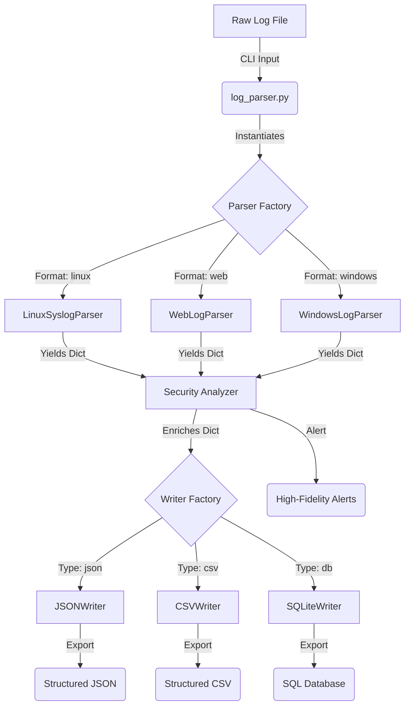

# Log Parser Toolkit


[](https://www.python.org/downloads/)
[](https://opensource.org/licenses/MIT)
[](https://github.com/LiamCarPer/log-parser-toolkit/actions/workflows/test.yml)

A robust, memory-efficient Python command-line utility designed to parse various unstructured log formats into structured JSON or CSV files. 

This toolkit was built to demonstrate clean software architecture, advanced regular expression (regex) parsing, **streaming data processing** (Generator pattern for large files), and user-friendly CLI design using `argparse`. It serves as a flexible ingestion layer for log data analysis.

## Table of Contents
- [Architecture](#architecture)
- [Features](#features)
- [Supported Formats](#supported-formats)
- [Project Structure](#project-structure)
- [Installation](#installation)
- [Usage](#usage)
- [Security Analysis Engine](#security-analysis-engine)
- [SIGMA Rule Integration](#sigma-rule-integration)
- [IOC Extraction Engine](#ioc-extraction-engine)
- [HTML Security Incident Report](#html-security-incident-report)
- [Examples](#examples)
- [Testing](#testing)

## Architecture

The system uses a modular design, allowing new parsers to be added dynamically. It utilizes a **generator pattern** to stream lines, avoiding Out-Of-Memory (OOM) issues on massive log files.


```mermaid
graph TD
    A[Raw Log File] -->|CLI Input| B(log_parser.py)
    B -->|Instantiates| C{Parser Factory}
    C -->|Format: linux| D[LinuxSyslogParser]
    C -->|Format: web| E[WebLogParser]
    C -->|Format: windows| F[WindowsLogParser]
    D -->|Yields Dict| G[Security Analyzer]
    E -->|Yields Dict| G
    F -->|Yields Dict| G
    G -->|Enriches Dict| H{Writer Factory}
    H -->|Type: json| I[JSONWriter]
    H -->|Type: csv| J[CSVWriter]
    H -->|Type: db| K[SQLiteWriter]
    I -->|Export| L(Structured JSON)
    J -->|Export| M(Structured CSV)
    K -->|Export| N(SQL Database)
    G -->|Alert| O(High-Fidelity Alerts)
```

## Features

- **Memory Efficient (Streaming):** Parses logs line-by-line using Python Generators (`yield`). Can process multi-gigabyte log files without crashing or hogging RAM.
- **Transparent Decompression:** Natively handles `.gz` files. Automatically detects and decompresses log archives on-the-fly without requiring manual extraction.
- **Live Pipeline Integration:** Fully supports Standard Input (`stdin`) using the `-` flag, enabling seamless integration with tools like `tail -f`, `grep`, and `awk` for real-time log analysis.
- **Temporal Normalization:** Automatically converts disparate vendor-specific timestamps (Syslog, Apache, Windows) into a unified, strict **ISO 8601** UTC format for easy SIEM correlation.
- **SIGMA Rule Integration:** Leverages a lightweight, dependency-free custom Python evaluator to dynamically load and match standard YAML-based **SIGMA detection rules** (supporting modifiers like `contains`, `startswith`, `endswith`, `re`, and `all` with complex boolean conditions/quantifiers). Automatically tags matches with MITRE ATT&CK techniques.
- **Structured IOC Extraction:** Scans parsed log fields for Indicators of Compromise (IOCs)—including public IPv4/IPv6 addresses, URLs, domains, MD5/SHA256 hashes, and emails—generating a structured JSON threat report (`--ioc-report`).
- **MITRE ATT&CK Mapping:** Every alert is automatically tagged with the corresponding MITRE ATT&CK technique ID, technique name, tactic, and reference URL. Flat `mitre_technique_ids` and `mitre_tactics` fields are included in all output formats (JSON, CSV, SQLite) for direct SIEM ingestion and threat reporting.
- **Offline GeoIP & ASN Mapping:** Automatically enriches IP addresses with geographical metadata (Country, City) and Network information (ASN/ISP) using local MaxMind databases for high-speed offline analysis.
- **User-Agent Anomaly Flagging:** Inspects web logs to flag suspicious, malformed, or weaponized user agents (e.g., `sqlmap`, `nmap`) and detects potentially malicious requests with missing headers.
- **Direct SQL Export:** Natively supports exporting parsed logs directly to a **SQLite** database (`--type db`), enabling complex relational queries and advanced threat hunting using standard SQL.
- **Stateful Security Analysis:** Implements a middleware processing layer that evaluates logs against security rules (e.g., SSH Brute Force, Web Scanning) using a rolling time window.
- **AbuseIPDB Threat Intelligence:** Seamlessly enriches log data with IP reputation scores from the AbuseIPDB API. Features a local **Threat Intel Cache** to ensure high performance.
- **High-Fidelity Alert Routing:** Automatically identifies and routes security-critical events to a dedicated `--alert-file`.
- **Terminal Statistics Dashboard:** Provides immediate situational awareness with a professional, colorized terminal summary showing Top IPs, Status Code distribution, and an Alert breakdown with MITRE technique IDs upon completion.
- **Decoupled Pattern Matching:** Supports loading custom regex patterns from external JSON files via `--format custom`, allowing the tool to adapt to bespoke log formats without source code changes.

## Supported Formats

- **Linux Syslog** (`linux`): Parses standard Linux syslog messages extracting Timestamp, Hostname, Process/PID, and the core Message.
- **Web Logs** (`web`): Parses the industry-standard Apache/Nginx combined log format (IP, Ident, User, Timestamp, Request, Status, Bytes, Referer, User-Agent).
- **Windows Event Logs** (`windows`): Parses Windows Event Logs that have been exported to CSV format, acting as a normalization layer.
- **Custom Formats** (`custom`): Load bespoke regex patterns from a JSON file via `--format custom --pattern-file <file> --pattern-name <name>`.

## Project Structure

```text
log-parser-toolkit/
├── pyproject.toml                   # Package definition
├── sigma_rules/                     # Bundled SIGMA detection rules (YAML)
├── log_parser_toolkit/              # Main package
│   ├── cli.py                       # CLI entry point (argparse, dashboard)
│   ├── api.py                       # parse_stream() middleware pipeline
│   ├── parsers/
│   │   ├── base.py                  # Abstract BaseParser (stdin/gzip/file)
│   │   ├── linux.py                 # Syslog parsing logic (Regex)
│   │   ├── web.py                   # Apache/Nginx parsing logic (Regex)
│   │   ├── windows.py               # Windows Event Log CSV ingestion
│   │   └── utils.py                 # Timestamp normalization, IP extraction
│   ├── writers/
│   │   ├── json_writer.py           # Streaming JSON array output
│   │   ├── csv_writer.py            # CSV DictWriter output
│   │   └── sqlite_writer.py         # Batched SQLite insert output
│   ├── sigma/
│   │   ├── __init__.py              # Sigma module public API
│   │   ├── evaluator.py             # Custom dependency-free SIGMA evaluator
│   │   └── loader.py                # SIGMA rule loader & middleware
│   ├── ioc/
│   │   ├── __init__.py              # IOC module public API
│   │   └── extractor.py             # IOC Extraction middleware (IPs, domains, hashes)
│   └── analyzer/
│       ├── middleware.py            # StatefulSecurityAnalyzer orchestrator
│       ├── rules.py                 # 5 detection rules (SSH, priv-esc, web scan…)
│       ├── threat_intel.py          # AbuseIPDB cache
│       └── mitre_mappings.json      # MITRE ATT&CK technique lookup table
├── samples/                         # Rich incident simulation logs (syslog, web) & pre-generated reports
├── tests/                           # Pytest unit & integration tests
└── .github/workflows/               # CI/CD pipelines
```

## Installation

1. Ensure you have Python 3.8+ installed.
2. Clone the repository and navigate to the root directory.
3. Install the package in a virtual environment:

```bash
# Create a virtual environment
python -m venv .venv

# Activate the virtual environment
# On macOS/Linux:
source .venv/bin/activate  
# On Windows:
# .venv\Scripts\activate

# Install the toolkit locally
pip install -e .

# Optional: Install with GeoIP support for IP enrichment
pip install -e ".[geoip]"

# Optional: Install with PyYAML for SIGMA rule loading
pip install -e ".[sigma]"
```

## Usage

Once installed, you can use the `log-parser` command anywhere inside your virtual environment.

```bash
log-parser --input <path_to_log> --format <format_name> --output <path_to_output> --type <json|csv> [options]
```

### Arguments:

- `--input`: Path to the input log file.
- `--format`: Format of the log file (e.g., `linux`, `web`, `windows`).
- `--output`: Path to save the parsed output file.
- `--type`: Desired output file type (`json`, `csv`, or `db` for SQLite).
- `--analyze`: (Optional) Enable the stateful security analysis engine.
- `--sigma-rules`: (Optional) Path to a directory or single file containing SIGMA rules (YAML).
- `--ioc-report`: (Optional) Path to write a structured JSON IOC extraction report.
- `--report`: (Optional) Path to write the interactive HTML incident report dashboard.
- `--alert-file`: (Optional) Path to save security-critical events (alerts).
- `--abuseipdb-key`: (Optional) Your AbuseIPDB API key for automatic threat scoring.
- `--geoip-db`: (Optional) Path to your local MaxMind GeoLite2-City.mmdb for IP enrichment.
- `--error-file`: (Optional) Path to save unmatched log lines.
- `--strict`: (Optional) Fail immediately on the first unmatched line.
- `--verbose`: (Optional) Enable debug-level logging.

## Security Analysis Engine

The toolkit features a stateful security analysis engine (enabled via `--analyze`) that performs real-time threat detection and enrichment. 

The engine operates on a **middleware pattern**, intercepting log records between the parsing and output stages. Analysis is **stateful**, meaning it doesn't just look at single lines in isolation; it maintains a sliding-window memory buffer (`deque`) to correlate events (like login failures or 404 spikes) over time.

### Detection Rules

| # | Rule | Trigger | MITRE Technique | Tactic |
|---|---|---|---|---|
| 1 | **SSH Brute Force** | 5+ `sshd` failed logins from same IP in 60 s | [T1110.001](https://attack.mitre.org/techniques/T1110/001/) | Credential Access |
| 2 | **Privilege Escalation** | `sudo` with `USER=root` or `/bin/bash` | [T1548.003](https://attack.mitre.org/techniques/T1548/003/) | Privilege Escalation |
| 3 | **Web Directory Scanning** | 10+ `4xx`/`5xx` errors from same IP in 60 s | [T1595.003](https://attack.mitre.org/techniques/T1595/003/) | Reconnaissance |
| 4 | **Suspicious User-Agent** | Scanner/tool UA strings (`sqlmap`, `nikto`, `nmap` …) | [T1595.002](https://attack.mitre.org/techniques/T1595/002/) | Reconnaissance |
| 5 | **Missing User-Agent** | Empty or `-` User-Agent header | [T1036](https://attack.mitre.org/techniques/T1036/) | Defense Evasion |
| 6 | **Windows Brute Force** | 5+ Event ID `4625` for same account in 60 s | [T1110.001](https://attack.mitre.org/techniques/T1110/001/) | Credential Access |
| 7 | **Known Malicious IP** | AbuseIPDB confidence score ≥ 80 | [T1071](https://attack.mitre.org/techniques/T1071/) | Command & Control |

### Real-world Alert Output (JSON)

When an alert is triggered, the engine enriches the log entry with detailed security metadata including MITRE ATT&CK context:

```json
{
  "timestamp": "2026-03-22T10:20:00Z",
  "ip": "45.12.34.56",
  "status": "404",
  "user_agent": "sqlmap/1.5",
  "is_alert": true,
  "alert_reason": "Web Directory Scanning; Suspicious User-Agent; Known Malicious IP",
  "details": "Detected 10 error responses within 60s; Detected potential automated tool: sqlmap; IP has high AbuseIPDB score: 95",
  "threat_score": 95,
  "country": "Netherlands",
  "mitre_technique_ids": "T1595.003; T1595.002; T1071",
  "mitre_tactics": "Reconnaissance; Command and Control",
  "alerts": [
    {
      "alert_reason": "Web Directory Scanning",
      "details": "Detected 10 error responses (4xx/5xx) from 45.12.34.56 within 60s",
      "mitre_attack": {
        "technique_id": "T1595.003",
        "technique_name": "Active Scanning: Wordlist Scanning",
        "tactic": "Reconnaissance",
        "tactic_id": "TA0043",
        "reference": "https://attack.mitre.org/techniques/T1595/003/"
      }
    },
    {
      "alert_reason": "Suspicious User-Agent",
      "details": "Detected potential automated tool/scanner: sqlmap",
      "mitre_attack": {
        "technique_id": "T1595.002",
        "technique_name": "Active Scanning: Vulnerability Scanning",
        "tactic": "Reconnaissance",
        "tactic_id": "TA0043",
        "reference": "https://attack.mitre.org/techniques/T1595/002/"
      }
    },
    {
      "alert_reason": "Known Malicious IP",
      "details": "IP 45.12.34.56 has high AbuseIPDB score: 95",
      "mitre_attack": {
        "technique_id": "T1071",
        "technique_name": "Application Layer Protocol",
        "tactic": "Command and Control",
        "tactic_id": "TA0011",
        "reference": "https://attack.mitre.org/techniques/T1071/"
      }
    }
  ]
}
```

## SIGMA Rule Integration

The toolkit includes built-in support for evaluating vendor-agnostic [SIGMA rules](https://github.com/SigmaHQ/sigma) against log streams. When you specify `--sigma-rules <path>`, the engine:
1. Loads all YAML SIGMA rules from the specified file or directory.
2. Uses a **custom, dependency-free condition evaluator** that compiles and evaluates selection logic.
3. Supports SIGMA field modifiers: `contains`, `startswith`, `endswith`, `re` (regular expression), and `all` (for multi-value AND matching).
4. Handles compound logical expressions (e.g., `selection1 and not filter1`, `1 of selection*`, `all of them`) using a recursive-descent parser.
5. Automatically extracts and maps MITRE ATT&CK technique tags (e.g., `attack.t1110.001`) from rules to enrich alerts.

### Example Bundled Rules
A set of pre-packaged SIGMA rules is included in the [sigma_rules/](file:///media/liamcarvajal/Storage/code/log-parser-toolkit/sigma_rules/) directory:
- [ssh_failed_login.yml](file:///media/liamcarvajal/Storage/code/log-parser-toolkit/sigma_rules/ssh_failed_login.yml) (MITRE T1110.001 - Credential Access)
- [ssh_invalid_user.yml](file:///media/liamcarvajal/Storage/code/log-parser-toolkit/sigma_rules/ssh_invalid_user.yml) (MITRE T1110.001 - Credential Access)
- [privilege_escalation.yml](file:///media/liamcarvajal/Storage/code/log-parser-toolkit/sigma_rules/privilege_escalation.yml) (MITRE T1548.003 - Privilege Escalation)
- [suspicious_user_agent.yml](file:///media/liamcarvajal/Storage/code/log-parser-toolkit/sigma_rules/suspicious_user_agent.yml) (MITRE T1595.002 - Reconnaissance)
- [web_sql_injection.yml](file:///media/liamcarvajal/Storage/code/log-parser-toolkit/sigma_rules/web_sql_injection.yml) (MITRE T1190 - Initial Access)
- [web_invalid_method.yml](file:///media/liamcarvajal/Storage/code/log-parser-toolkit/sigma_rules/web_invalid_method.yml) (MITRE T1595 - Reconnaissance)
- [windows_account_failure.yml](file:///media/liamcarvajal/Storage/code/log-parser-toolkit/sigma_rules/windows_account_failure.yml) (MITRE T1110.001 - Credential Access)
- [windows_account_lockout.yml](file:///media/liamcarvajal/Storage/code/log-parser-toolkit/sigma_rules/windows_account_lockout.yml) (MITRE T1078.002 - Defense Evasion / Initial Access)

### Usage Example
```bash
log-parser --input /var/log/auth.log --format linux --output parsed.json --type json --sigma-rules sigma_rules/
```

## IOC Extraction Engine

The Indicators of Compromise (IOC) Extraction Engine automatically scans parsed logs for high-signal forensics indicators. When `--ioc-report <path>` is provided, the engine extracts:
- **IP Addresses:** Extracts public IPv4 and IPv6 addresses (private/RFC 1918 IPs are filtered out).
- **Domains & URLs:** Extracts domains and full http/https URLs, deduplicating domains already found in URLs.
- **File Hashes:** Identifies MD5 and SHA-256 patterns. To prevent false positives, hash extraction is restricted to textual payload fields (e.g., `message`, `request`).
- **Emails:** Extracts email addresses found in log fields.

### JSON Report Structure
The generated report is saved as a structured JSON file:
```json
{
  "extraction_timestamp": "2026-05-24T15:47:31Z",
  "total_records_processed": 500,
  "counts": {
    "public_ipv4": 2,
    "ipv6": 1,
    "domain": 2,
    "url": 1,
    "md5": 1,
    "sha256": 1,
    "email": 1
  },
  "indicators": {
    "public_ipv4": ["45.12.34.56", "185.220.101.5"],
    "ipv6": ["2001:db8::1"],
    "domain": ["evil-c2.com", "phishing-link.org"],
    "url": ["https://evil-c2.com/payload.exe"],
    "md5": ["4475236279f538e1548e6530a6f44f77"],
    "sha256": ["e3b0c44298fc1c149afbf4c8996fb92427ae41e4649b934ca495991b7852b855"],
    "email": ["attacker@malicious.domain"]
  }
}
```

### Usage Example
```bash
log-parser --input logs/web_access.log --format web --output parsed_web.json --type json --ioc-report ioc_report.json
```

## HTML Security Incident Report

The toolkit features a premium, interactive **HTML Incident Report Generator** (enabled via `--report <path>`) designed to present parsed intelligence in a visual dashboard suitable for recruiters and SOC leads.

When `--report` is specified, the tool automatically under-the-hood:
1. Runs the Stateful Security Analysis engine (`--analyze`).
2. Loads bundled SIGMA detection rules (if `PyYAML` is installed).
3. Automatically runs the IOC Extraction Engine.
4. Generates a self-contained interactive HTML/CSS dashboard with zero external assets required.

### Key Visual Components:
- **Overview Dashboard**: General parser execution metrics (success %, total records, alerts, active IOCs) with interactive Doughnut and Bar charts showing status code distribution and rule match frequency.
- **Triggered Alerts List**: A filterable table of triggered alerts. Includes a live Javascript search filter (by IP, signature, details) and a threat severity filter. Supports expanding rows to inspect raw log entries in structured JSON.
- **IOC Catalog**: A clean card-based index of all extracted indicators (public IPs, domains, URLs, hashes, emails) with quick copy-to-clipboard buttons.
- **MITRE ATT&CK Matrix**: An interactive matrix mapping tactical coverage. Triggered techniques (e.g., *Sudo Abuse*, *Brute Force*) are highlighted automatically with trigger counts.
- **Event Timeline**: A chronological timeline visualizing the progression of security alerts.

### Usage Example:
```bash
# Generate the report using the rich incident syslog simulation file
log-parser --input samples/sample_incident_syslog.log --format linux --output parsed.json --type json --report report.html
```

You can view a pre-generated sample report directly: [sample_report.html](samples/sample_report.html).

## Examples

### 1. Basic Syslog Parsing to JSON
```bash
log-parser --input samples/sample_syslog.log --format linux --output output.json --type json
```

### 2. Live Threat Hunting (stdin) to SQLite
```bash
tail -f /var/log/syslog | log-parser --format linux --output live_forensics.db --type db --alert-file alerts.csv
```

### 3. Full Security Analysis with Threat Intel & GeoIP
```bash
log-parser --input logs/auth.log --format linux --output full_data.csv --type csv --analyze --alert-file critical_alerts.csv --abuseipdb-key YOUR_API_KEY --geoip-db GeoLite2-City.mmdb
```

### 4. Windows Event Log Ingestion to SQLite
```bash
log-parser --input samples/sample_windows.csv --format windows --output audit_report.db --type db --analyze
```

### 5. Custom Regex Pattern Ingestion
```bash
# Parse a bespoke format using an external regex definition
log-parser --input custom.log --format custom --pattern-file samples/patterns_sample.json --pattern-name firewall_legacy --output results.json --type json
```

## Testing

The project uses `pytest` for unit testing the regex patterns, parser logic, and the security analyzer middleware.

To run the full test suite:
```bash
pytest tests/
```
